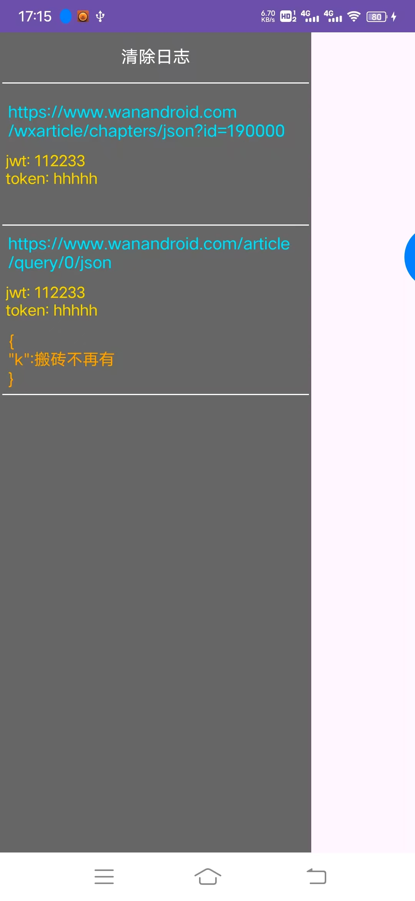
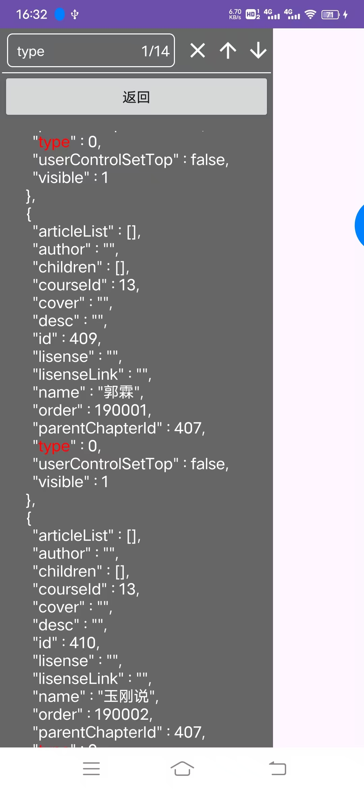

# LogFloat

#### 介绍
- 简单的、用于查看okhttp请求日志的悬浮窗view，可以展示请求接口和结果，搜索关键字。
- 主要是方便测试的时候查看请求内容。
- 仅用于测试环境。

#### 使用说明
> module引入或者 `implementation("io.github.bndg:floatlog:1.0.2")`
1. okhttp addInterceptor（示例中有个LoggingInterceptor）
2. start FloatViewService (启动前台服务需要判断系统版本）
3. 在Interceptor中，按需发送数据到悬浮窗
``` kotlin
LogManager.instance.logUpdated(
            HttpLogEvent(
                url,
                requestBodyJson,
                hashValue,
                results,
                headers.toString()
            )
        )
```
#### 截图
<table>
    <tr>
        <td></td>
        <td></td>
	<td></td>
    </tr>
</table>